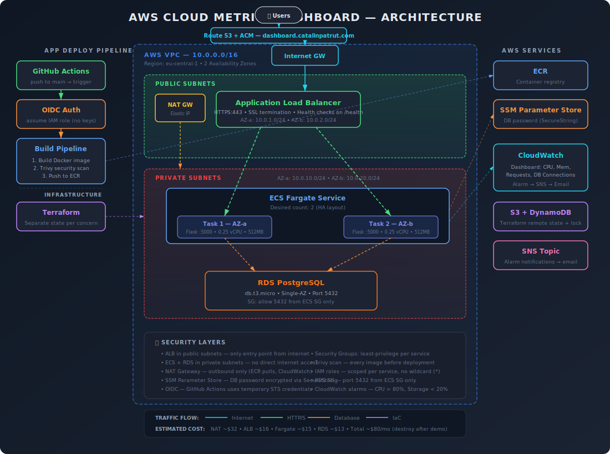

# AWS Cloud Metrics Dashboard

CloudWatch metrics dashboard deployed on AWS ECS Fargate with Terraform IaC, GitHub Actions CI/CD (OIDC), and automated monitoring.

Infrastructure is currently down to avoid ongoing costs.

## Architecture

## Tech Stack

| Category           | Tools                                                        |
|--------------------|--------------------------------------------------------------|
| **Application**    | Python, Flask, SQLAlchemy, Gunicorn, psycopg3                |
| **Infrastructure** | AWS (ECS Fargate, ALB, RDS PostgreSQL, VPC, Route53, ACM)    |
| **IaC**            | Terraform (S3 + DynamoDB remote state)                       |
| **CI/CD**          | GitHub Actions, OIDC auth, Trivy, ECR                        |
| **Monitoring**     | CloudWatch dashboards, CloudWatch alarms, SNS                |
| **Security**       | OIDC, private subnets, non-root containers, TLS 1.2/1.3, SSM Parameter Store |

## Design Decisions & Production Considerations

This project is built on production infrastructure patterns with deliberate cost and complexity tradeoffs for a portfolio deployment.

| Decision | Current Setup | Production Change |
|----------|--------------|-------------------|
| **Availability** | Single Fargate task, no auto-scaling | 2+ tasks across AZs with auto-scaling. ALB, health checks, and multi-AZ subnets are already in place — requires a `desired_count` change. |
| **NAT Gateway** | Single NAT in one AZ (~$32/mo) | One NAT per AZ for AZ failure resilience |
| **Image tags** | Mutable ECR tags for dev flexibility | Immutable tags with git SHA to prevent tampering |
| **Terraform** | Manual plan/apply | Automated plan on PR, apply on merge with approval gate |
| **RDS** | Single-AZ, unencrypted, no deletion protection | Multi-AZ failover, encryption at rest, deletion protection, final snapshot on destroy |
| **Secrets** | DB password in SSM Parameter Store, other DB config as env vars | All credentials in SSM or Secrets Manager, no plaintext in task definitions |
| **ALB logging** | No access logs | ALB access logs to S3 for debugging and security audit |
| **Log retention** | Default (never expire) | CloudWatch log retention set to 30-90 days |